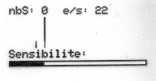
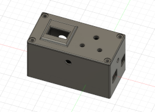
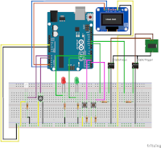
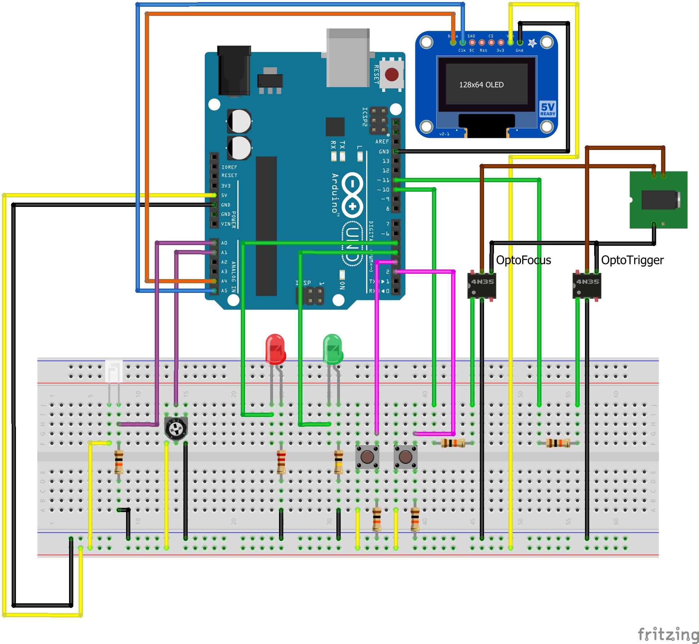

# SmartShutter Description
> Pour la version française, [c'est par ici](READMEfr.md).
## What's this ?
SmartShutter is a DIY project allowing to drive a reflex digital camera, here it is a Nikon D600 but could be any device allowing a binary (on/off) input for shutter and focus, using a "standalone" device but also using a computer.
This project has been done from an original idea of Florent Pin on [storm chasers forum](https://forum.chasseurs-orages.com/viewtopic.php?t=6243), I have took this idea and adapted it to my needs in order to make a more evolved tool.

It provide different features like:
* Lightning detection (3 detection modes)
* Timelapse
* Simply remote control

 
## And for which purpose ?
I designed it mainly to use my reflex camera to take pictures from stars, galaxys, planets, with my telescope. And additionaly to try to do some lightning pictures. Ability to trigger a picture without touching the telescope setup (no vibrations) and without quiting my computer, is convenient when we do astrophotography.

## User guide
### Main features
There are 3 main features available:
* __Lightning detection__: Triggers a shot from the camera when detect any flash in the direction of the photosensor. 3 detections modes are available:
  * _Variation_ : Will detect a quick change of the ambiant brightness, you can adjust the sensivity of the detection with the potentiometer (depicted by an horizontal line on the screen)
  * _Average_ : Will detect when the brightness exceed the average of the latest measures, you can adjust the sensivity of the detection with the potentiometer (depicted by an horizontal line on the screen)
  * _Forced_ : Will detect when the brightness exceed the threshold set with the potentiometer (depicted by an horizontal line on the screen)
* __Timelapse__: Will trigger a shot from the camera each times the elapsed time is reached. This delay is displayed on the screen in minutes and can be changed using the potentiometer
* __Direct shot__: Will trigger a shot every time you push the "SET" button

### Change feature
If you want to change the selected feature, push the "MODE" button. It will cycle the features like this: `Lightning detection > Timelapse > Direct Shot`.

  

### Change detection mode
This option is available only in __Lightning detection__, to change the detection mode, push the "SET" button. It will cycle the detection modes like this: `Variation > Average > Forced`.

  
>`nbS` means "Number of Shots" - `e/s` means number of measure per second

### Power supply
User any of the standard way to power an Arduino. Through USB using a computer or a portable power bank, or by the Jack power input using a battery case or a live transformer.

# Software

## Arduino code

### The program itself
Code for programming the Arduino controller can be found under `src` folder. It is written in "real" C++ (I'm using PlatformIO under VSCode), but can be easily ported to Arduino IDE.
The program will require following libraries:
```
#include <Wire.h>
#include <Adafruit_GFX.h>
#include <Adafruit_SSD1306.h>
```
>Note that the big hexadecimal part at the beginning was to display my logo on the OLED screen at startup but I've disabled this part to save memory in the microcontroler.

This code can be adapted and transformed but be careful ! I am very close to overload the Arduino available memory, so if you add too much additional variable you may encounter some memory troubleshooting like glitches on the screen, freezing of the Arduino and so on.

### Settings adaptations
You will see at the begining of the code the following constants, they are there in order to adjust some values according to your wiring and components. I give you below the english translation of the comments who indicate what each constant talks about:
```
#define POTENTIOMETER_MAX   940         // Maximum analog value of the potentiometer (you have to measure that by testing it)
#define POTENTIOMETER_MIN   30          // Minimum analog value of the potentiometer (you have to measure that by testing it because it's never a real zero)
#define SENSIBILITY_MAX     100         // Maximum sensitivity wanted
#define SENSIBILITY_MIN     3           // Minimum sensitivity wanted
#define HISTORY_DEPTH       16          // Length of the stored measure array (default 16) !! Careful here, if you put a big value, you will be in memory trouble
#define VALUE_MAX           960         // Maximum analog value of the phototransistor (you have to measure that by testing it)
#define DEBOUNCE_TIME       10          // Button push debounce time
#define TIMELAPSE_GAP       10          // Default timelapse steps duration
#define TIMELAPSE_MAX       1440        // Maximum duration of the whole timelapse cycle
#define USB_LATENCY         10          // Millisecond delay to be used during serial communication with the computer and the UI
```

## Computer UI code
Code for the computer UI is written in groovy and can be executed using a local jdk or jre engine (java). Usually everyone have this installed in a standard Windows OS. The needed jar libraries are provided under `UI/lib` but you can use the latest ones by uncommenting and adapting the maven part in the UI launcher `SmartShutter.bat`.

The program can take 2 optional parameters in input (both can be used at the same time):
* `SmartShutter debug` : Will start the UI in DEBUG MODE
* `SmartShutter lang:en` : Will set the language to english (en) or french (fr). French is default.
>You can update the `.bat` launcher to force any of these parameters to avoid to type it every time.

1. At startup, the software will try to detect the device by itself so it will be better that the device is already connected to the computer before launching the software.
2. Go to "Connection" menu and choose "Connection to SmartShutter", the result of the autodetection will be displayed

   

3. Click on "Connection" to start the communication between the software and the device

   

Once this step done, you can use all the other features of the software to take control of the device from the computer.
# Hardware

## Skills
This project can be done without any specific skills other than tin soldering. 3D printing skills are optional as you can use the box you want to put the hardware in, or very limited skills as the 3D design is already done for you and available in this repository (stl files). Same for wiring as all the schematics are available in this repository too (fritzing sketch, png and diy files).

 

## Material
* 1x Arduino Uno
* 1x [OLED Screen I2C 128x64](https://amzn.eu/d/16eJRzV)
* 1x Red 3mm LED
* 1x Green 3mm LED
* 2x Optocoupler (4N35)
* 1x Potentiometer (0 to 10kOhms)
* 2x Push buttons
* 1x [Phototransistor (3DU5C)](https://amzn.eu/d/ha9QPGW)
* 1x Female Jack 2.5mm connector
* 2x 220 Ohms resistors
* 5x 10k Ohms resistors
* 1x [Prototyping card for soldering additional components](https://amzn.eu/d/ezlYbJF)

## Wiring
I provide 3 types of schematics for wiring to help you building this project.
### Fritzing sketch

### DIYLC sketch for prototyping card

### Electric schematics in png from EasyEDA


### Pictures
 

 

 
