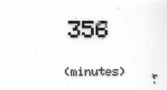

# SmartShutter Description
## De quoi s'agit-il ?
SmartShutter est un projet DIY qui permet de controler un APN reflex, ici un Nikon D600 mais n'importe quel autre appareil permettant un controle on/off sur l'obturateur et la mise au point peut faire l'affaire, en utilisant un appareil independant mais aussi un ordinateur.
Ce projet a été réalisé à partir d'une idée originale de Florent Pin sur le [forum des chasseurs d'orage](https://forum.chasseurs-orages.com/viewtopic.php?t=6243), je l'ai reprise et adaptée à mes besoin pour en faire un outil plus pointu.

Il fournit 3 fonctionnalités:
* Détéction d'éclair (3 modes de detection)
* Timelapse
* Controle à distance simple

 
## A quoi ça sert ?
Je l'ai designé principalement pour utiliser mon APN reflex en astrophoto avec mon telescope. Et en plus, permettre de faire des photos d'éclairs orageux. En astrophoto permettre le déclenchement de l'obturateur sans toucher à l'installation évite les vibrations, ce qui est meilleur pour la qualité des photos.

## Guide utilisateur
### Principales fonctionnalités
3 sont disponibles:
* __Détéction d'éclairs__: Déclenche une prise de vue lorsqu'il détécte un flash dans la direction du capteur photosensible. 3 modes de detection sont disponibles:
  * _Variation_ : Détecte une brusque variation de la lumière ambiante, la sensibilité est réglable avec le potentiometre (représentée par une ligne horizontale sur l'écran)
  * _Moyenne_ : Détecte lorsque la luminosité dépasse la moyenne des dernières mesures, la sensibilité est réglable avec le potentiometre (représentée par une ligne horizontale sur l'écran)
  * _Fixe_ : Détecte lorsque la luminosité dépasse le seuil défini par le potentiometre (représentée par une ligne horizontale sur l'écran)
* __Timelapse__: Déclenche une prise de vue chaque fois que le temps écoulé atteint la valeur réglée. Le délais est affiché en minutes sur l'écran et peut être modifié avec le potentiometre
* __Prise de vue directe__: Déclenche une prise de vue à chaque fois que vous appuyez sur le bouton "SET"

### Changer de fonctionnalité
Pour changer la fonctionnalité active presser le bouton "MODE". Les fonctionnalités vont défiler selon ce sycle: `Détection d'éclair > Timelapse > Prise de vue`.

  

### Changer le mode de détection
Cette option n'est disponible qu'en __Détection d'éclair__, pour changer de mode de detection, appuyer sur le bouton "SET". Les modes de détection vont défiler selon ce cycle: `Variation > Moyenne > Fixe`.

  
>`nbS` signifie "Nombre de prises de vue" - `e/s` signifie "Nombre d'échantillonnages par seconde"

### Alimentation
Utiliser n'importe quel alimentation standard d'Arduino. Avec un cable USB depuis un ordinateur ou une power bank, ou avec une prise Jack en utilisant un support de batterie ou un transfo sur le secteur.

# Logiciel

## Code Arduino

### Le programme
Le programme du microcontroleur se trouve dans le répertoire `src`. Il est écrit en "vrai" C++ (J'utilise PlatformIO depuis VSCode), mais peut facilement être adapté pour l'IDE Arduino.
Le programme nécessite les bibliothéques suivantes:
```
#include <Wire.h>
#include <Adafruit_GFX.h>
#include <Adafruit_SSD1306.h>
```
>Notez que la grosse partie en hexa au début du programme était prévue pour l'affichage de mon logo au démarrage sur l'écran OLED, mais j'ai désactivé cette partie pour économiser de la mémoire sur le microcontroleur.

Ce code peut être adapté et transformé mais faites attention ! Je suis très proche des limites mémoires de l'Arduino, donc si vous ajoutez trop de variable vous risquez de rencontrer des problèmes mémoire comme des glitches d'affichage ou des plantage de l'Arduino.

### Adaptation des réglages
You will see at the begining of the code the following constants, they are there in order to adjust some values according to your wiring and components. I give you below the english translation of the comments who indicate what each constant talks about:
```
#define POTENTIOMETER_MAX   940         // Valeur maximum du potentiometre
#define POTENTIOMETER_MIN   30          // Valeur minimum du potentiometre
#define SENSIBILITY_MAX     100         // Sensibilité maximum réglable
#define SENSIBILITY_MIN     3           // Sensibilité minimum réglable
#define HISTORY_DEPTH       16          // Profondeur de la matrice d'historique des valeurs (default 16)
#define VALUE_MAX           960         // Valeur maximum donnée par le phototransistor
#define DEBOUNCE_TIME       10          // Nb de millisecondes pour debouncer les boutons
#define TIMELAPSE_GAP       10          // Nb de minutes par défaut du timelapse
#define TIMELAPSE_MAX       1440        // Durée maximum du timelapse en minutes
#define USB_LATENCY         10          // Latence de la communication serie
```

## Code du logiciel PC
Le code de l'interface utilisateur est écrit en groovy et peut être executé avec un jdk ou jre local (java). Habituellement tout le monde en a une version sur un OS standard Windows. Les bibliothéques Java nécessaires sont fournies dans le répertoire `UI/lib` mais vous pouvez utiliser les dernières version en décommentant et en adaptant la partie Maven dans le lanceur `SmartShutter.bat`.

Le programme peut prendre 2 paramètres facultatifs (ils peuvent être utilisés en même temps):
* `SmartShutter debug` : Lance l'écran en mode DEBUG
* `SmartShutter lang:en` : Force la langue en anglais (en) ou français (fr). Le français est la langue par défaut.
>Vous pouvez modifier le lanceur `.bat` pour forcer la langue ou le mode et éviter de devoir le passer en paramètre à chaque fois.

1. Au démarrage, le logiciel va essayer de détecter le périphérique automatiquement, il est donc préferable d'avoir déjà connecté le SmartShutter à l'ordinateur avant de lancer le logiciel.
2. Aller dans le menu "Communication" et choisir "Communication avec le SmartShutter, le résultat de l'autodétection y sera affiché.

   

3. Cliquer sur "Connexion" pour démarrer la communication entre le SmartShutter et le logiciel.

   

Une fois cette étape effectuée, vous pouvez utiliser les autres fonctionnalités du logiciel et prendre le controle de l'appareil depuis l'ordinateur.
# Hardware

## Compétences
Ce projet peut être réalisé sans compétences particulières autres que la soudure à l'étain. Les compétences en impression 3D sont facultatives car vous pouvez utiliser n'importe quel boitier pour y placer l'éléctronique, ou toutefois des compétences limitées en impression 3D étant donné que le design du boitier est déjà fait et disponible dans ce repository (fichiers stl). Idem pour le cablage, tous les schémas sont disponibles dans ce repository également (fichiers fritzing, png et diy).

 

## Materiel
* 1x Arduino Uno
* 1x [Ecran OLED I2C 128x64](https://amzn.eu/d/16eJRzV)
* 1x LED Rouge Red 3mm
* 1x LED Verte 3mm
* 2x Optocoupleur (4N35)
* 1x Potentiometre (0 to 10kOhms)
* 2x Boutons poussoir
* 1x [Phototransistor (3DU5C)](https://amzn.eu/d/ha9QPGW)
* 1x Connecteur Jack femelle 2.5mm
* 2x Résistances 220 Ohms
* 5x Résistances 10k Ohms
* 1x [Carte de Prototypage pour la soudure des composants additionnels](https://amzn.eu/d/ezlYbJF)

## Cablage
Je fournis 3 types de schémas pour le cablage pour vous aider à réaliser ce projet.
### Sketch Fritzing

### Sketch DIYLC pour la carte de prototypage

### Schéma éléctrique normalisé en png depuis EasyEDA


### Photos
 

 

 
